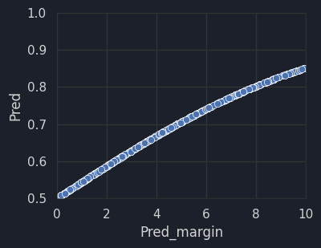

```python
%reset -f

import warnings
warnings.simplefilter("ignore")

import json
from glob import glob
import numpy as np
import pandas as pd
import matplotlib.pyplot as plt
import seaborn as sns
import xgboost as xgb
import torch
import torch.nn.functional as F
from sklearn.preprocessing import StandardScaler

pd.set_option("display.expand_frame_repr", False)
pd.set_option("display.max_columns", None)
pd.set_option("display.width", None)

plt.style.use('dark_background')
sns.set_theme(style="darkgrid")
sns.set_context("notebook")
plt.rcParams['figure.facecolor'] = '#1B202B'
plt.rcParams['axes.facecolor'] = '#1B202B'
plt.rcParams['text.color'] = '#d4d4d4'
plt.rcParams['axes.labelcolor'] = '#d4d4d4'
plt.rcParams['xtick.color'] = '#d4d4d4'
plt.rcParams['ytick.color'] = '#d4d4d4'
plt.rcParams['grid.color'] = '#333333'
plt.rcParams['savefig.facecolor'] = '#1b202b'
plt.rcParams['axes.edgecolor'] = '#333333'
plt.rcParams['axes.linewidth'] = 0.5
sns.set_palette("deep")

model_dir = "./models"
dataset_dir = "../datasets/net-dataset"
comp_dir = "../datasets/march-machine-learning-mania-2025"
```


```python
print("stats\n")

stats = pd.read_csv(f"{dataset_dir}/season_2025.csv")

stats = pd.concat([
    stats.select_dtypes("int").astype("int32"),
    stats.select_dtypes("float").astype("float32"),
], axis=1)

display(stats.shape, stats.iloc[[stats.index.min(), stats.index.max()]])
print()
```

    stats
    


    (726, 58)


<div>
<style scoped>
    .dataframe tbody tr th:only-of-type {
        vertical-align: middle;
    }

    .dataframe tbody tr th {
        vertical-align: top;
    }

    .dataframe thead th {
        text-align: right;
    }
</style>
<table border="1" class="dataframe">
  <thead>
    <tr style="text-align: right;">
      <th></th>
      <th>Season</th>
      <th>TeamID</th>
      <th>Score_poss_o</th>
      <th>FGM_poss_o</th>
      <th>FGA_poss_o</th>
      <th>FGM3_poss_o</th>
      <th>FGA3_poss_o</th>
      <th>FTM_poss_o</th>
      <th>FTA_poss_o</th>
      <th>OR_poss_o</th>
      <th>DR_poss_o</th>
      <th>Ast_poss_o</th>
      <th>TO_poss_o</th>
      <th>Stl_poss_o</th>
      <th>Blk_poss_o</th>
      <th>PF_poss_o</th>
      <th>Score_poss_d</th>
      <th>FGM_poss_d</th>
      <th>FGA_poss_d</th>
      <th>FGM3_poss_d</th>
      <th>FGA3_poss_d</th>
      <th>FTM_poss_d</th>
      <th>FTA_poss_d</th>
      <th>OR_poss_d</th>
      <th>DR_poss_d</th>
      <th>Ast_poss_d</th>
      <th>TO_poss_d</th>
      <th>Stl_poss_d</th>
      <th>Blk_poss_d</th>
      <th>PF_poss_d</th>
      <th>sos_Score_poss_o</th>
      <th>sos_FGM_poss_o</th>
      <th>sos_FGA_poss_o</th>
      <th>sos_FGM3_poss_o</th>
      <th>sos_FGA3_poss_o</th>
      <th>sos_FTM_poss_o</th>
      <th>sos_FTA_poss_o</th>
      <th>sos_OR_poss_o</th>
      <th>sos_DR_poss_o</th>
      <th>sos_Ast_poss_o</th>
      <th>sos_TO_poss_o</th>
      <th>sos_Stl_poss_o</th>
      <th>sos_Blk_poss_o</th>
      <th>sos_PF_poss_o</th>
      <th>sos_Score_poss_d</th>
      <th>sos_FGM_poss_d</th>
      <th>sos_FGA_poss_d</th>
      <th>sos_FGM3_poss_d</th>
      <th>sos_FGA3_poss_d</th>
      <th>sos_FTM_poss_d</th>
      <th>sos_FTA_poss_d</th>
      <th>sos_OR_poss_d</th>
      <th>sos_DR_poss_d</th>
      <th>sos_Ast_poss_d</th>
      <th>sos_TO_poss_d</th>
      <th>sos_Stl_poss_d</th>
      <th>sos_Blk_poss_d</th>
      <th>sos_PF_poss_d</th>
    </tr>
  </thead>
  <tbody>
    <tr>
      <th>0</th>
      <td>2025</td>
      <td>1101</td>
      <td>0.963398</td>
      <td>0.342737</td>
      <td>0.785438</td>
      <td>0.059869</td>
      <td>0.202676</td>
      <td>0.218055</td>
      <td>0.305387</td>
      <td>0.118090</td>
      <td>0.278473</td>
      <td>0.174664</td>
      <td>0.198282</td>
      <td>0.144455</td>
      <td>0.038997</td>
      <td>0.298247</td>
      <td>1.019049</td>
      <td>0.338018</td>
      <td>0.733760</td>
      <td>0.082146</td>
      <td>0.247547</td>
      <td>0.260868</td>
      <td>0.372985</td>
      <td>0.127104</td>
      <td>0.323587</td>
      <td>0.177612</td>
      <td>0.229230</td>
      <td>0.112118</td>
      <td>0.063829</td>
      <td>0.254762</td>
      <td>1.018438</td>
      <td>0.355316</td>
      <td>0.825067</td>
      <td>0.099417</td>
      <td>0.305568</td>
      <td>0.208388</td>
      <td>0.292848</td>
      <td>0.132596</td>
      <td>0.321734</td>
      <td>0.181639</td>
      <td>0.178676</td>
      <td>0.100344</td>
      <td>0.051079</td>
      <td>0.256303</td>
      <td>1.047087</td>
      <td>0.365335</td>
      <td>0.826247</td>
      <td>0.101833</td>
      <td>0.300998</td>
      <td>0.214584</td>
      <td>0.300272</td>
      <td>0.128371</td>
      <td>0.323762</td>
      <td>0.193434</td>
      <td>0.170004</td>
      <td>0.107262</td>
      <td>0.053681</td>
      <td>0.257105</td>
    </tr>
    <tr>
      <th>725</th>
      <td>2025</td>
      <td>3480</td>
      <td>0.899466</td>
      <td>0.322678</td>
      <td>0.797620</td>
      <td>0.080165</td>
      <td>0.281839</td>
      <td>0.173944</td>
      <td>0.257134</td>
      <td>0.140668</td>
      <td>0.314107</td>
      <td>0.172935</td>
      <td>0.229908</td>
      <td>0.098820</td>
      <td>0.031764</td>
      <td>0.235958</td>
      <td>0.974593</td>
      <td>0.360209</td>
      <td>0.833046</td>
      <td>0.079652</td>
      <td>0.265844</td>
      <td>0.174524</td>
      <td>0.244536</td>
      <td>0.136473</td>
      <td>0.303894</td>
      <td>0.181119</td>
      <td>0.195832</td>
      <td>0.107048</td>
      <td>0.042109</td>
      <td>0.250117</td>
      <td>0.914648</td>
      <td>0.331866</td>
      <td>0.814081</td>
      <td>0.085874</td>
      <td>0.276438</td>
      <td>0.165042</td>
      <td>0.230668</td>
      <td>0.129117</td>
      <td>0.312529</td>
      <td>0.168998</td>
      <td>0.213542</td>
      <td>0.102238</td>
      <td>0.037615</td>
      <td>0.237132</td>
      <td>0.946776</td>
      <td>0.345428</td>
      <td>0.821794</td>
      <td>0.086808</td>
      <td>0.271276</td>
      <td>0.169112</td>
      <td>0.238518</td>
      <td>0.135945</td>
      <td>0.323726</td>
      <td>0.178865</td>
      <td>0.209203</td>
      <td>0.106593</td>
      <td>0.042306</td>
      <td>0.231166</td>
    </tr>
  </tbody>
</table>
</div>


    


```python
print("matchups\n")

matchups = pd.read_csv(f"{comp_dir}/SampleSubmissionStage2.csv")
matchups[["Season", "TeamID_1", "TeamID_2"]] = matchups["ID"].str.split('_', expand=True).astype("int32")
matchups = matchups.drop(columns="Pred")
# display(matchups.shape, matchups.iloc[[matchups.index.min(), matchups.index.max()]])
# print()

teams = pd.concat([
    pd.read_csv(f"{comp_dir}/MTeams.csv"),
    pd.read_csv(f"{comp_dir}/WTeams.csv"),
])[["TeamID", "TeamName"]]

for i in [1, 2]:
    matchups = pd.merge(
        matchups, 
        teams, 
        left_on=[f"TeamID_{i}"],
        right_on=["TeamID"],
        suffixes=["_1", "_2"],
    ).drop(columns=["TeamID"])

for i in [1, 2]:
    matchups = pd.merge(
        matchups, 
        stats, 
        left_on=["Season", f"TeamID_{i}"],
        right_on=["Season", "TeamID"],
        suffixes=["_1", "_2"],
    ).drop(columns=["TeamID"])

display(matchups.shape, matchups.iloc[[matchups.index.min(), matchups.index.max()]])
print()

print("\nX_df\n")
X_df = matchups.drop(columns=["ID", "Season", "TeamID_1", "TeamID_2", "TeamName_1", "TeamName_2"])
# display(X_df.shape, X_df.iloc[[X_df.index.min(), X_df.index.max()]])
# print()
```

    matchups
    


    (131407, 118)


<div>
<style scoped>
    .dataframe tbody tr th:only-of-type {
        vertical-align: middle;
    }

    .dataframe tbody tr th {
        vertical-align: top;
    }

    .dataframe thead th {
        text-align: right;
    }
</style>
<table border="1" class="dataframe">
  <thead>
    <tr style="text-align: right;">
      <th></th>
      <th>ID</th>
      <th>Season</th>
      <th>TeamID_1</th>
      <th>TeamID_2</th>
      <th>TeamName_1</th>
      <th>TeamName_2</th>
      <th>Score_poss_o_1</th>
      <th>FGM_poss_o_1</th>
      <th>FGA_poss_o_1</th>
      <th>FGM3_poss_o_1</th>
      <th>FGA3_poss_o_1</th>
      <th>FTM_poss_o_1</th>
      <th>FTA_poss_o_1</th>
      <th>OR_poss_o_1</th>
      <th>DR_poss_o_1</th>
      <th>Ast_poss_o_1</th>
      <th>TO_poss_o_1</th>
      <th>Stl_poss_o_1</th>
      <th>Blk_poss_o_1</th>
      <th>PF_poss_o_1</th>
      <th>Score_poss_d_1</th>
      <th>FGM_poss_d_1</th>
      <th>FGA_poss_d_1</th>
      <th>FGM3_poss_d_1</th>
      <th>FGA3_poss_d_1</th>
      <th>FTM_poss_d_1</th>
      <th>FTA_poss_d_1</th>
      <th>OR_poss_d_1</th>
      <th>DR_poss_d_1</th>
      <th>Ast_poss_d_1</th>
      <th>TO_poss_d_1</th>
      <th>Stl_poss_d_1</th>
      <th>Blk_poss_d_1</th>
      <th>PF_poss_d_1</th>
      <th>sos_Score_poss_o_1</th>
      <th>sos_FGM_poss_o_1</th>
      <th>sos_FGA_poss_o_1</th>
      <th>sos_FGM3_poss_o_1</th>
      <th>sos_FGA3_poss_o_1</th>
      <th>sos_FTM_poss_o_1</th>
      <th>sos_FTA_poss_o_1</th>
      <th>sos_OR_poss_o_1</th>
      <th>sos_DR_poss_o_1</th>
      <th>sos_Ast_poss_o_1</th>
      <th>sos_TO_poss_o_1</th>
      <th>sos_Stl_poss_o_1</th>
      <th>sos_Blk_poss_o_1</th>
      <th>sos_PF_poss_o_1</th>
      <th>sos_Score_poss_d_1</th>
      <th>sos_FGM_poss_d_1</th>
      <th>sos_FGA_poss_d_1</th>
      <th>sos_FGM3_poss_d_1</th>
      <th>sos_FGA3_poss_d_1</th>
      <th>sos_FTM_poss_d_1</th>
      <th>sos_FTA_poss_d_1</th>
      <th>sos_OR_poss_d_1</th>
      <th>sos_DR_poss_d_1</th>
      <th>sos_Ast_poss_d_1</th>
      <th>sos_TO_poss_d_1</th>
      <th>sos_Stl_poss_d_1</th>
      <th>sos_Blk_poss_d_1</th>
      <th>sos_PF_poss_d_1</th>
      <th>Score_poss_o_2</th>
      <th>FGM_poss_o_2</th>
      <th>FGA_poss_o_2</th>
      <th>FGM3_poss_o_2</th>
      <th>FGA3_poss_o_2</th>
      <th>FTM_poss_o_2</th>
      <th>FTA_poss_o_2</th>
      <th>OR_poss_o_2</th>
      <th>DR_poss_o_2</th>
      <th>Ast_poss_o_2</th>
      <th>TO_poss_o_2</th>
      <th>Stl_poss_o_2</th>
      <th>Blk_poss_o_2</th>
      <th>PF_poss_o_2</th>
      <th>Score_poss_d_2</th>
      <th>FGM_poss_d_2</th>
      <th>FGA_poss_d_2</th>
      <th>FGM3_poss_d_2</th>
      <th>FGA3_poss_d_2</th>
      <th>FTM_poss_d_2</th>
      <th>FTA_poss_d_2</th>
      <th>OR_poss_d_2</th>
      <th>DR_poss_d_2</th>
      <th>Ast_poss_d_2</th>
      <th>TO_poss_d_2</th>
      <th>Stl_poss_d_2</th>
      <th>Blk_poss_d_2</th>
      <th>PF_poss_d_2</th>
      <th>sos_Score_poss_o_2</th>
      <th>sos_FGM_poss_o_2</th>
      <th>sos_FGA_poss_o_2</th>
      <th>sos_FGM3_poss_o_2</th>
      <th>sos_FGA3_poss_o_2</th>
      <th>sos_FTM_poss_o_2</th>
      <th>sos_FTA_poss_o_2</th>
      <th>sos_OR_poss_o_2</th>
      <th>sos_DR_poss_o_2</th>
      <th>sos_Ast_poss_o_2</th>
      <th>sos_TO_poss_o_2</th>
      <th>sos_Stl_poss_o_2</th>
      <th>sos_Blk_poss_o_2</th>
      <th>sos_PF_poss_o_2</th>
      <th>sos_Score_poss_d_2</th>
      <th>sos_FGM_poss_d_2</th>
      <th>sos_FGA_poss_d_2</th>
      <th>sos_FGM3_poss_d_2</th>
      <th>sos_FGA3_poss_d_2</th>
      <th>sos_FTM_poss_d_2</th>
      <th>sos_FTA_poss_d_2</th>
      <th>sos_OR_poss_d_2</th>
      <th>sos_DR_poss_d_2</th>
      <th>sos_Ast_poss_d_2</th>
      <th>sos_TO_poss_d_2</th>
      <th>sos_Stl_poss_d_2</th>
      <th>sos_Blk_poss_d_2</th>
      <th>sos_PF_poss_d_2</th>
    </tr>
  </thead>
  <tbody>
    <tr>
      <th>0</th>
      <td>2025_1101_1102</td>
      <td>2025</td>
      <td>1101</td>
      <td>1102</td>
      <td>Abilene Chr</td>
      <td>Air Force</td>
      <td>0.963398</td>
      <td>0.342737</td>
      <td>0.785438</td>
      <td>0.059869</td>
      <td>0.202676</td>
      <td>0.218055</td>
      <td>0.305387</td>
      <td>0.118090</td>
      <td>0.278473</td>
      <td>0.174664</td>
      <td>0.198282</td>
      <td>0.144455</td>
      <td>0.038997</td>
      <td>0.298247</td>
      <td>1.019049</td>
      <td>0.338018</td>
      <td>0.733760</td>
      <td>0.082146</td>
      <td>0.247547</td>
      <td>0.260868</td>
      <td>0.372985</td>
      <td>0.127104</td>
      <td>0.323587</td>
      <td>0.177612</td>
      <td>0.229230</td>
      <td>0.112118</td>
      <td>0.063829</td>
      <td>0.254762</td>
      <td>1.018438</td>
      <td>0.355316</td>
      <td>0.825067</td>
      <td>0.099417</td>
      <td>0.305568</td>
      <td>0.208388</td>
      <td>0.292848</td>
      <td>0.132596</td>
      <td>0.321734</td>
      <td>0.181639</td>
      <td>0.178676</td>
      <td>0.100344</td>
      <td>0.051079</td>
      <td>0.256303</td>
      <td>1.047087</td>
      <td>0.365335</td>
      <td>0.826247</td>
      <td>0.101833</td>
      <td>0.300998</td>
      <td>0.214584</td>
      <td>0.300272</td>
      <td>0.128371</td>
      <td>0.323762</td>
      <td>0.193434</td>
      <td>0.170004</td>
      <td>0.107262</td>
      <td>0.053681</td>
      <td>0.257105</td>
      <td>0.965239</td>
      <td>0.330836</td>
      <td>0.781041</td>
      <td>0.124514</td>
      <td>0.369940</td>
      <td>0.179053</td>
      <td>0.282471</td>
      <td>0.092614</td>
      <td>0.324147</td>
      <td>0.205808</td>
      <td>0.187285</td>
      <td>0.086439</td>
      <td>0.044763</td>
      <td>0.277326</td>
      <td>1.121273</td>
      <td>0.402782</td>
      <td>0.840700</td>
      <td>0.106933</td>
      <td>0.297377</td>
      <td>0.208775</td>
      <td>0.298395</td>
      <td>0.121191</td>
      <td>0.363573</td>
      <td>0.190443</td>
      <td>0.149197</td>
      <td>0.103878</td>
      <td>0.050411</td>
      <td>0.268861</td>
      <td>1.066900</td>
      <td>0.377442</td>
      <td>0.841200</td>
      <td>0.111792</td>
      <td>0.324409</td>
      <td>0.200224</td>
      <td>0.278698</td>
      <td>0.122976</td>
      <td>0.336836</td>
      <td>0.197336</td>
      <td>0.159148</td>
      <td>0.093554</td>
      <td>0.049741</td>
      <td>0.248756</td>
      <td>1.045811</td>
      <td>0.369129</td>
      <td>0.833412</td>
      <td>0.113857</td>
      <td>0.334173</td>
      <td>0.193697</td>
      <td>0.274158</td>
      <td>0.119409</td>
      <td>0.332479</td>
      <td>0.197052</td>
      <td>0.165367</td>
      <td>0.092135</td>
      <td>0.048760</td>
      <td>0.255037</td>
    </tr>
    <tr>
      <th>131406</th>
      <td>2025_3479_3480</td>
      <td>2025</td>
      <td>3479</td>
      <td>3480</td>
      <td>Mercyhurst</td>
      <td>West Georgia</td>
      <td>0.853335</td>
      <td>0.291744</td>
      <td>0.721370</td>
      <td>0.092316</td>
      <td>0.287601</td>
      <td>0.177532</td>
      <td>0.243218</td>
      <td>0.071604</td>
      <td>0.309497</td>
      <td>0.141434</td>
      <td>0.243218</td>
      <td>0.078114</td>
      <td>0.017161</td>
      <td>0.256237</td>
      <td>0.948972</td>
      <td>0.356159</td>
      <td>0.800033</td>
      <td>0.064756</td>
      <td>0.221348</td>
      <td>0.171898</td>
      <td>0.248428</td>
      <td>0.115972</td>
      <td>0.330256</td>
      <td>0.170132</td>
      <td>0.206631</td>
      <td>0.118916</td>
      <td>0.032967</td>
      <td>0.262557</td>
      <td>0.863030</td>
      <td>0.315585</td>
      <td>0.807401</td>
      <td>0.083793</td>
      <td>0.273216</td>
      <td>0.148067</td>
      <td>0.205587</td>
      <td>0.123168</td>
      <td>0.315765</td>
      <td>0.177942</td>
      <td>0.225309</td>
      <td>0.094576</td>
      <td>0.037304</td>
      <td>0.235417</td>
      <td>0.947380</td>
      <td>0.346968</td>
      <td>0.831799</td>
      <td>0.093702</td>
      <td>0.289379</td>
      <td>0.159742</td>
      <td>0.221994</td>
      <td>0.134860</td>
      <td>0.330536</td>
      <td>0.199487</td>
      <td>0.205383</td>
      <td>0.111322</td>
      <td>0.040888</td>
      <td>0.223541</td>
      <td>0.899466</td>
      <td>0.322678</td>
      <td>0.797620</td>
      <td>0.080165</td>
      <td>0.281839</td>
      <td>0.173944</td>
      <td>0.257134</td>
      <td>0.140668</td>
      <td>0.314107</td>
      <td>0.172935</td>
      <td>0.229908</td>
      <td>0.098820</td>
      <td>0.031764</td>
      <td>0.235958</td>
      <td>0.974593</td>
      <td>0.360209</td>
      <td>0.833046</td>
      <td>0.079652</td>
      <td>0.265844</td>
      <td>0.174524</td>
      <td>0.244536</td>
      <td>0.136473</td>
      <td>0.303894</td>
      <td>0.181119</td>
      <td>0.195832</td>
      <td>0.107048</td>
      <td>0.042109</td>
      <td>0.250117</td>
      <td>0.914648</td>
      <td>0.331866</td>
      <td>0.814081</td>
      <td>0.085874</td>
      <td>0.276438</td>
      <td>0.165042</td>
      <td>0.230668</td>
      <td>0.129117</td>
      <td>0.312529</td>
      <td>0.168998</td>
      <td>0.213542</td>
      <td>0.102238</td>
      <td>0.037615</td>
      <td>0.237132</td>
      <td>0.946776</td>
      <td>0.345428</td>
      <td>0.821794</td>
      <td>0.086808</td>
      <td>0.271276</td>
      <td>0.169112</td>
      <td>0.238518</td>
      <td>0.135945</td>
      <td>0.323726</td>
      <td>0.178865</td>
      <td>0.209203</td>
      <td>0.106593</td>
      <td>0.042306</td>
      <td>0.231166</td>
    </tr>
  </tbody>
</table>
</div>


    
    
    X_df
    


```python
n_splits = 5
xgb_models = [None] * n_splits
nn_models = [None] * n_splits

for path in glob(f"{model_dir}/*"):
    model_type, brier_score, fold_n = path.split("/")[-1].split(".")[0].split("_")
    i = int(fold_n) - 1
    if model_type == "xgb":
        xgb_models[i] = xgb.XGBRegressor()
        xgb_models[i].load_model(path)
    elif model_type == "nn":
        with open(path) as f:
            nn_models[i] = json.load(f)

y_preds = []
```


```python
print(f"xgb ", end="", flush=True)
X_cudf = X_df

for fold_n, m in enumerate(xgb_models, 1):
    print(f"{fold_n} ", end="", flush=True)
    y_preds.append(m.predict(X_cudf))
```

    xgb 1 2 3 4 5 


```python
print(f"nn ", end="", flush=True)
device = "cuda"

X = torch.as_tensor(
    StandardScaler().fit_transform(X_df),
    dtype=torch.float32,
    device=device,
)

for fold_n, m_py in enumerate(nn_models, 1):
    print(f"{fold_n} ", end="", flush=True)

    m = {
        "w": [torch.tensor(w, device=device) for w in m_py["w"]], 
        "b": [torch.tensor(b, device=device) for b in m_py["b"]]
    }

    def forward():
        return F.leaky_relu(X @ m["w"][0] + m["b"][0], negative_slope=0.1) @ m["w"][1] + m["b"][1]

    y_preds.append(forward().cpu().numpy().flatten())
```

    nn 1 2 3 4 5 


```python
print("submission\n")

submission = matchups[["ID", "TeamID_1", "TeamID_2", "TeamName_1", "TeamName_2"]]
submission["Pred_margin"] = np.mean(y_preds, axis=0)
submission["Pred"] = 1 / (1 + np.exp(-submission["Pred_margin"] * 0.175))
submission[["ID", "Pred"]].to_csv("submission.csv", index=False)
submission
```

    submission
    


<div>
<style scoped>
    .dataframe tbody tr th:only-of-type {
        vertical-align: middle;
    }

    .dataframe tbody tr th {
        vertical-align: top;
    }

    .dataframe thead th {
        text-align: right;
    }
</style>
<table border="1" class="dataframe">
  <thead>
    <tr style="text-align: right;">
      <th></th>
      <th>ID</th>
      <th>TeamID_1</th>
      <th>TeamID_2</th>
      <th>TeamName_1</th>
      <th>TeamName_2</th>
      <th>Pred_margin</th>
      <th>Pred</th>
    </tr>
  </thead>
  <tbody>
    <tr>
      <th>0</th>
      <td>2025_1101_1102</td>
      <td>1101</td>
      <td>1102</td>
      <td>Abilene Chr</td>
      <td>Air Force</td>
      <td>-0.032739</td>
      <td>0.498568</td>
    </tr>
    <tr>
      <th>1</th>
      <td>2025_1101_1103</td>
      <td>1101</td>
      <td>1103</td>
      <td>Abilene Chr</td>
      <td>Akron</td>
      <td>-6.184379</td>
      <td>0.253077</td>
    </tr>
    <tr>
      <th>2</th>
      <td>2025_1101_1104</td>
      <td>1101</td>
      <td>1104</td>
      <td>Abilene Chr</td>
      <td>Alabama</td>
      <td>-17.400698</td>
      <td>0.045429</td>
    </tr>
    <tr>
      <th>3</th>
      <td>2025_1101_1105</td>
      <td>1101</td>
      <td>1105</td>
      <td>Abilene Chr</td>
      <td>Alabama A&amp;M</td>
      <td>5.525233</td>
      <td>0.724504</td>
    </tr>
    <tr>
      <th>4</th>
      <td>2025_1101_1106</td>
      <td>1101</td>
      <td>1106</td>
      <td>Abilene Chr</td>
      <td>Alabama St</td>
      <td>1.554789</td>
      <td>0.567605</td>
    </tr>
    <tr>
      <th>...</th>
      <td>...</td>
      <td>...</td>
      <td>...</td>
      <td>...</td>
      <td>...</td>
      <td>...</td>
      <td>...</td>
    </tr>
    <tr>
      <th>131402</th>
      <td>2025_3477_3479</td>
      <td>3477</td>
      <td>3479</td>
      <td>East Texas A&amp;M</td>
      <td>Mercyhurst</td>
      <td>0.387899</td>
      <td>0.516964</td>
    </tr>
    <tr>
      <th>131403</th>
      <td>2025_3477_3480</td>
      <td>3477</td>
      <td>3480</td>
      <td>East Texas A&amp;M</td>
      <td>West Georgia</td>
      <td>-3.691308</td>
      <td>0.343896</td>
    </tr>
    <tr>
      <th>131404</th>
      <td>2025_3478_3479</td>
      <td>3478</td>
      <td>3479</td>
      <td>Le Moyne</td>
      <td>Mercyhurst</td>
      <td>-2.828356</td>
      <td>0.378725</td>
    </tr>
    <tr>
      <th>131405</th>
      <td>2025_3478_3480</td>
      <td>3478</td>
      <td>3480</td>
      <td>Le Moyne</td>
      <td>West Georgia</td>
      <td>-6.181085</td>
      <td>0.253186</td>
    </tr>
    <tr>
      <th>131406</th>
      <td>2025_3479_3480</td>
      <td>3479</td>
      <td>3480</td>
      <td>Mercyhurst</td>
      <td>West Georgia</td>
      <td>-4.391933</td>
      <td>0.316785</td>
    </tr>
  </tbody>
</table>
<p>131407 rows × 7 columns</p>
</div>


```python
plt.figure(figsize=(4, 3))
sns.scatterplot(submission[submission["Pred_margin"]**2<100].sample(n=1000), x="Pred_margin", y="Pred")
plt.xlim(0, 10)
plt.ylim(0.5, 1)
plt.show();
```


    

    


```python
men = submission[submission["TeamID_1"] < 3000]

men_1 = men[["TeamID_1", "TeamName_1", "TeamID_2", "TeamName_2", "Pred_margin"]]
men_1 = men_1.rename(columns={"TeamID_1": "TeamID", "TeamName_1": "TeamName", "TeamID_2": "OppID", "TeamName_2": "OppName"})

men_2 = men[["TeamID_1", "TeamName_1", "TeamID_2", "TeamName_2", "Pred_margin"]]
men_2 = men_2.rename(columns={"TeamID_2": "TeamID", "TeamName_2": "TeamName", "TeamID_1": "OppID", "TeamName_1": "OppName"})
men_2["Pred_margin"] = -men_2["Pred_margin"]

men = pd.concat([men_1, men_2]).sort_values("TeamID").reset_index(drop=True)
print(men.head(3))
print(men.shape)
```

       TeamID     TeamName  OppID    OppName  Pred_margin
    0    1101  Abilene Chr   1102  Air Force    -0.032739
    1    1101  Abilene Chr   1360  San Diego    -0.970217
    2    1101  Abilene Chr   1359    Samford    -6.136386
    (132132, 5)


```python
rank = men[["TeamID", "TeamName", "Pred_margin"]][men["Pred_margin"] > 0]
rank = rank.groupby(["TeamID", "TeamName"]).count().reset_index().rename(columns={"Pred_margin": "Wins"})
rank = rank.sort_values(["Wins", "TeamID"], ascending=False).reset_index(drop=True).reset_index(names="Rank")
rank["Rank"] += 1
rank = rank.head(64)
print(rank.head(3))
print(rank.shape)
```

       Rank  TeamID TeamName  Wins
    0     1    1120   Auburn   363
    1     2    1181     Duke   362
    2     3    1222  Houston   361
    (64, 4)


```python
bracket = []
for t in rank[["Rank", "TeamName", "TeamID"]].values:
    bracket.append(tuple(t))

higher_seeds = bracket[:32]
lower_seeds = list(reversed(bracket))[:32]

for i in [32, 16, 8, 4, 2, 1]:
    print(f"Round of {i*2}")
    for j, (t1, t2) in list(enumerate(zip(higher_seeds, lower_seeds))):
        margin = men[(men["TeamID"]==t1[2]) & (men["OppID"]==t2[2])]["Pred_margin"].squeeze()
        if margin < 0:
            higher_seeds[j] = t2
            lower_seeds[j] = t1
            margin = -margin
        team1 = f"#{higher_seeds[j][0]} {higher_seeds[j][1]}"
        print(f"{team1:>16} {-round(margin*2)/2:>5} over #{lower_seeds[j][0]} {lower_seeds[j][1]}")
    if i > 0:
        lower_seeds = list(reversed(higher_seeds))[:i//2]
        higher_seeds = higher_seeds[:i//2]
    print()
```

    Round of 64
           #1 Auburn -10.0 over #64 Utah
             #2 Duke  -9.0 over #63 Pittsburgh
          #3 Houston  -8.5 over #62 Nevada
          #4 Florida  -7.5 over #61 Drake
        #5 Tennessee  -6.5 over #60 Nebraska
          #6 Alabama  -8.0 over #59 McNeese St
          #7 Gonzaga  -6.0 over #58 Indiana
       #8 Texas Tech  -5.0 over #57 Northwestern
         #9 Kentucky  -4.5 over #56 Colorado St
         #10 Iowa St  -4.5 over #55 San Francisco
        #11 Illinois  -4.0 over #54 Dayton
     #12 Michigan St  -4.0 over #53 Oklahoma
        #13 Missouri  -4.0 over #52 Santa Clara
         #14 Arizona  -3.0 over #51 New Mexico
       #15 St John's  -2.5 over #50 North Texas
    #16 St Mary's CA  -3.0 over #49 San Diego St
          #17 Kansas  -3.0 over #48 SMU
     #18 Connecticut  -2.5 over #47 Vanderbilt
       #19 Wisconsin  -2.5 over #46 Utah St
         #20 Georgia  -1.5 over #45 Xavier
      #21 Louisville  -1.5 over #44 West Virginia
          #22 Purdue  -1.5 over #43 Villanova
            #23 UCLA  -1.0 over #42 North Carolina
       #24 Texas A&M  -1.0 over #41 Arkansas
        #25 Maryland  -1.0 over #40 Oregon
         #26 Clemson  -1.0 over #39 Cincinnati
     #27 Mississippi  -0.5 over #38 Michigan
       #28 Marquette  -1.0 over #37 Ohio St
             #29 VCU  -0.5 over #36 Memphis
        #30 Boise St  -0.5 over #35 Mississippi St
          #31 Baylor  -0.5 over #34 Texas
             #33 BYU  -0.5 over #32 Creighton
    
    Round of 32
           #1 Auburn  -7.5 over #33 BYU
             #2 Duke  -5.5 over #31 Baylor
          #3 Houston  -5.5 over #30 Boise St
          #4 Florida  -5.5 over #29 VCU
        #5 Tennessee  -3.5 over #28 Marquette
          #6 Alabama  -3.5 over #27 Mississippi
          #7 Gonzaga  -2.5 over #26 Clemson
       #8 Texas Tech  -2.0 over #25 Maryland
         #9 Kentucky  -2.0 over #24 Texas A&M
         #10 Iowa St  -1.5 over #23 UCLA
        #11 Illinois  -1.5 over #22 Purdue
     #12 Michigan St  -1.0 over #21 Louisville
        #13 Missouri  -1.5 over #20 Georgia
         #14 Arizona  -0.5 over #19 Wisconsin
       #15 St John's  -0.5 over #18 Connecticut
          #17 Kansas  -1.0 over #16 St Mary's CA
    
    Round of 16
           #1 Auburn  -5.5 over #17 Kansas
             #2 Duke  -4.5 over #15 St John's
          #3 Houston  -4.5 over #14 Arizona
          #4 Florida  -3.0 over #13 Missouri
        #5 Tennessee  -2.0 over #12 Michigan St
          #6 Alabama  -1.5 over #11 Illinois
          #7 Gonzaga  -0.5 over #10 Iowa St
         #9 Kentucky  -0.5 over #8 Texas Tech
    
    Round of 8
           #1 Auburn  -4.0 over #9 Kentucky
             #2 Duke  -3.0 over #7 Gonzaga
          #3 Houston  -2.0 over #6 Alabama
          #4 Florida  -1.0 over #5 Tennessee
    
    Round of 4
           #1 Auburn  -1.5 over #4 Florida
             #2 Duke   0.0 over #3 Houston
    
    Round of 2
           #1 Auburn  -1.0 over #2 Duke
    


```python

```
